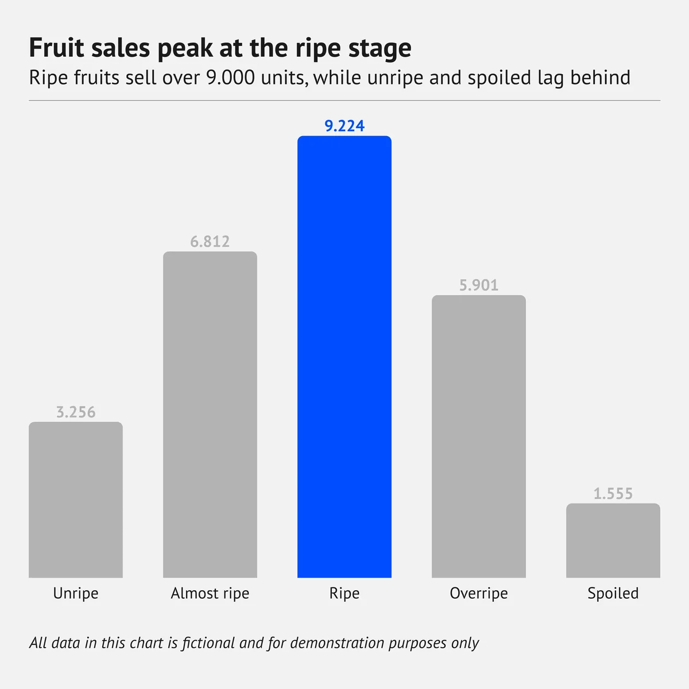

# What Makes A Good Plot? 

The best plots tell a story and need no other context with them to illustrate a point. They should be quickly digestible and insights gained quickly and easily. They should also have a clear audience in mind for the plot. Just like a story, book, or article. They vary in complexity based on the audience and tell a story or relay relevant information. For example Cat In The Hat probably isn't a great book for a PHD student. This doesn't make it  good book its just not its intended audience. 

Generally good plots have the following: 
- A clear audience 
- Tell a story 
- Limited number of categories
- Use color and line weight strategically
- Have clear axises 
- Highlight key stories
- Keep time intervals consistent

## Good Plot

The above images is a great example of a stacked horizontal bar chart. It has some clear easy to read information even while having a lot going on. We will break down elements of what makes this strong and a good example. First off all the colors have great contrast and split. Nothing gets lost for the average viewer. The added image aids in telling what the plot is about even from a distance. It has a hierarchy of what you should be looking at. Makes you read it naturally top to bottom and left to right.

We will break it down a bit more: 
- The title is big clear and simple 
  - Offers great contrast
- The subtitles are also part of the title but are broken up offer contrast 
  - In 45 countries is great 
  - Among adults  is one of the weaker elements as its similar color to the background
- The X labels are a bit unconventional being at the top as annotations 
  - This works here as you need to read them quickly to understand what the levels in the bar are about
- Then we have the data on the Y axis by country 
  - Not only do we get the name we get the flag
  - This aids the user in finding what they want to find 
- The bars have easy to see breaks 
  - The bars are labeled with the % 
  - They add up to 100% (seems logical but isn't always true)
- Sorted in a logical order 
  - This one takes a second to catch but its sorted highest education level (college) to least 
- Then we end with a by line 
  - Data source noted! 
  - Both are important so they can be verified and gone back to if needed

## Bad Plot

While this is visually pleasing it does a lot of right thing and a lot of wrong things. We will look at what it does well first then, dive into what we did wasn't so good.  

Things that it does well: 
- Has a clear title
- Has a descriptive subtitle 
- It highlights the value they want you to see
- Other values are muted 
- Values are noted above the bars 
- Has a byline with info 

Things that fail: 
- No X or Y axis on the plot 
- Its sorted by grow cycle but with the story highest sales to lowest might be better. 